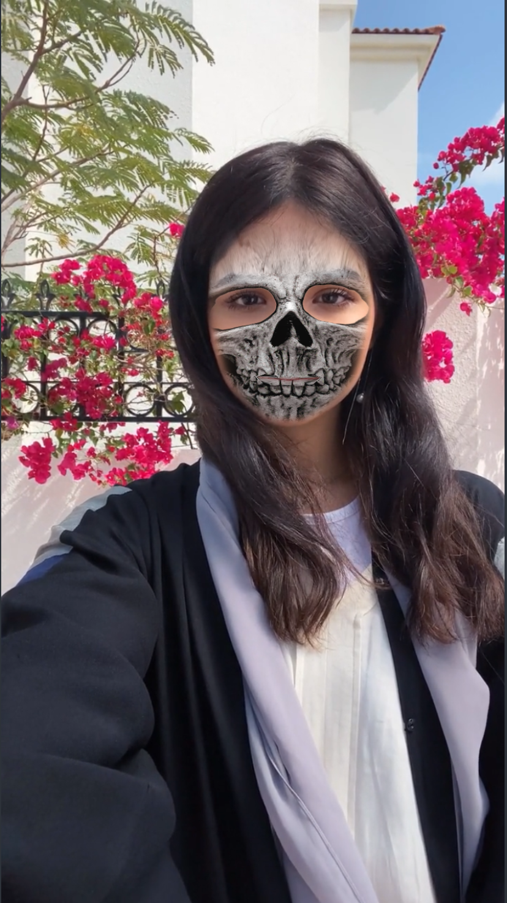
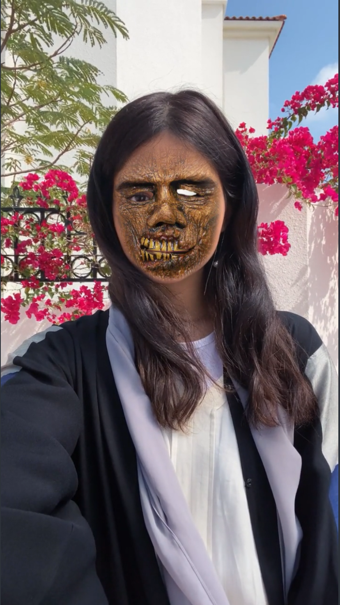

# HalloweenSpooks

This is a project that insert scary masks on a person's face! 
- The masks can be changed by taping on the screen.
- See if you can find the hidden mask!

| |  ||

## How to Use

Just install [Lens Studio](https://ar.snap.com/lens-studio) to view!
1. Clone the repository!
2. After opening Lens Studio, click open project and start using it!

